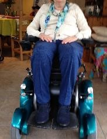

Postural care is a gentle, respectful and evolving process which aims to promote quality of life, function and comfort for individuals through the protection of body shape.

Any individual who spends prolonged periods of time in one positon is at risk of potentially life limiting body shape changes.

The body is a soft structure and is vulnerable to the effects of gravity.

Spending long periods of time in unsupported postures can cause the body to distort, flatten, bend and twist as it is compressed by gravity. 

Postural care aims to protect body shape through promoting movement and supported positioning throughout the day and night.

## What can Posture Partnership offer?

Effective postural care relies upon people having access to the right equipment and being well positioned most the time.

Posture Partnership can work with individuals to ensure, via skilled clinical assessment and product knowledge, that they have the correct equipment such as wheelchairs, armchairs and bed positioning supports.   

Posture Partnership provides training to individuals, support teams, healthcare professionals and equipment suppliers to develop confidence and knowledge in postural care and positioning to protect body shape.  

## What does postural care through right equipment and good positioning look like?

 

  Before Intervention | After Intervention
  ------------- | -------------
    | 
    | 
    | 
    | 

